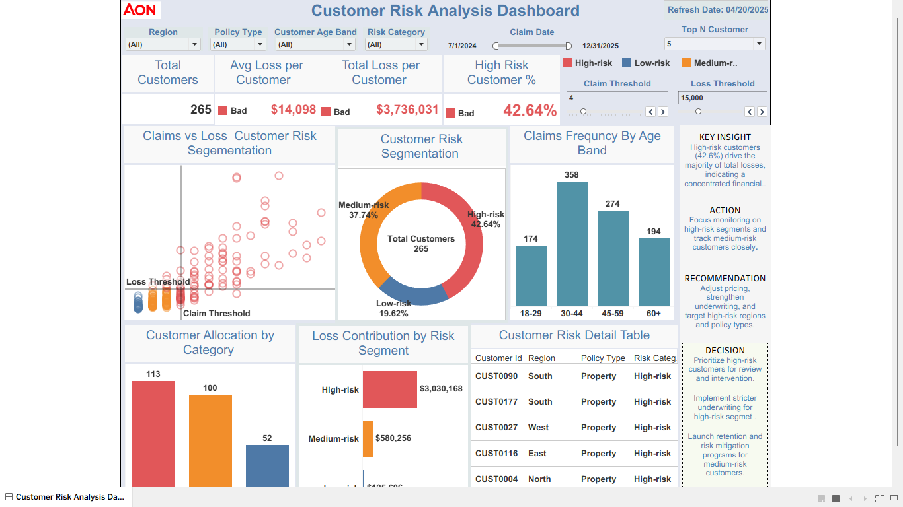

# Customer Risk Intelligence Platform

## Professional Tagline
A Product Analytics & Risk Intelligence Decision System for Customer Loss Monitoring, Risk Segmentation, and Operational Optimization.

# Business Problem

Insurance organizations face increasing challenges in identifying high-risk customers before loss exposure escalates.

# KPI Goals

- Total Customers
- Average Loss per Customer
- Total Loss Exposure
- High-Risk Customer %
- Claims Frequency
- Risk Segmentation Distribution

# Dataset

- Rows: 1000
- Columns: 10

# EDA Highlights

- risk segmentation analysis
- loss concentration analysis
- customer risk trends
- threshold monitoring
- operational analytics

# SQL / Data Preparation

Includes:
- CTEs
- joins
- aggregations
- window functions
- ranking logic

# Analysis

The analysis identifies concentrated financial exposure among high-risk customer segments and supports operational decision-making.

# Dashboard Preview



# Key Insights

- High-risk customers drive the majority of portfolio losses.
- Medium-risk customers represent intervention opportunities.
- Threshold monitoring improves operational visibility.

# Recommendations

- Prioritize high-risk customer intervention.
- Strengthen underwriting controls.
- Monitor high-loss regions and policy types.

# Decision

Implement stricter underwriting and risk mitigation strategies.

# Business Impact

- improved operational visibility
- reduced financial exposure
- stronger customer risk intelligence

# Tools & Technologies

- Python
- SQL
- Tableau
- Streamlit
- Pandas

# Streamlit Application

Run locally:

```bash
streamlit run app/streamlit_app.py
```

# Project Structure

```text
customer-risk-intelligence-platform/
│
├── data/
├── sql/
├── notebooks/
├── dashboard/
├── screenshots/
├── app/
├── docs/
├── requirements.txt
├── README.md
└── .gitignore
```

# How to Run

```bash
pip install -r requirements.txt
streamlit run app/streamlit_app.py
```

# Future Improvements

- predictive modeling
- anomaly detection
- real-time KPI monitoring
- experimentation systems

# About This Project

This repository demonstrates modern analytics decision-system thinking across customer risk analytics, KPI monitoring, and operational optimization.
